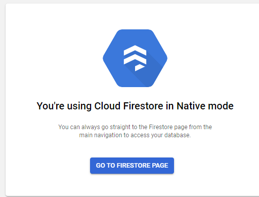
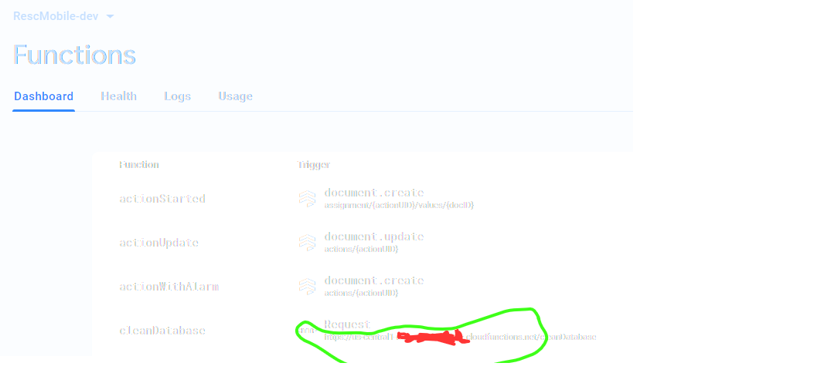

# System components summary

System is powered by following components:
 - Firestore database
 - Firebase Authentication
 - Firebase cloud functions
 - Web app written in Flutter
 - Mobile app written in Flutter
 
 Following doc aims to create your own environment for app
 
# Requirements for building
 
 - Flutter
 - Android Studio
 - for iOS builds: XCode
 - for convinient editing cloud functions Visual Code
 
# Setup of environment
 
 1. Go to <https://console.firebase.google.com/>
 2. Create new Firebase project
 3. Click on Project Settings in upper-left corner. Choose resource localization for Google Cloud Platform (note: if you don't select any option there, the deploy will fail).
 

 4. Go to Programming -> Database (left panel) and create new database. Then go to <https://console.cloud.google.com/> , select your project from dropdown. Then from Navigation menu on left go to Datastore section and make sure that Firestore is using native mode (if it's in datastorage then switch to native mode).
 
{:height="300px" width="300"}

# Download required components

1. From repo <http://cloud_functions_url.com> obtain code for cloud functions
2. From repo <http://web_app.com> obtain code for web application
3. From repo <http://mobile_app.com> obtain code for mobile application

# Prepare cloud functions (backend)

On firebase console go to Programming -> Functions. You will find instruction on how to install Firebase Function CLI on your computer, please follow them to initiate cloud functions in folder where you have cloned Cloud functions repo

Make sure you have owner acess for created Firebase project

Deploy cloud functions following instructions from google

In Firebase Console go to Programming -> Functions and make sure everything was deployed correctly


# Prepare database

In previous screen read URL on right side of function named initDatabase.
Using your favourite REST client (e.g. Postman or Insomnia) make POST request with json body to read URL:
```
https://<your-project>.cloudfunctions.net/initDatabase
```
```
{
    "email" : "mail@mail.com",
    "password": "password",
    "userName": "UserName"
}
```

This request will create your "superuser" with data given in payload, for first login to admin panel and some required documents for app to work

# Prepare web app

To prepare your environment for building and running web app please follow <https://flutter.dev/docs/get-started/web>

1. In Firebase project settings create Web app. After creating it, you will see various properties (like appID) that will be nececeary for later steps.
2. Go to RescWeb repository and modify file keys.dart with values taken from step 1. If you're adding new environment then modify config.dart as well, also add new main_xyz.dart file where xyz is your shortcut for environment named
3. To build the web app run flutter build web -t lib/main_xyz.dart
4. Once application is built then it needs to be deployed. Go to build/web folder and run firebase init
5. Select Hosting, then select public folder and choose single-page app
6. Copy everything from build/web into public (a subfolder), replace index.html
7. Run command firebase deploy
8. In order to login to web app you need to enable e-mail authentication first. Go to Firebase -> Authentication -> Sign-in method and enable e-mail/password 

# Prepare users

After you are ready to go with web app create some user with "coordinator" rights to be able to work in app. Account you have created during **Preparing database** step should be used only for maintance, because functions for clearing database are not secured before accident tapping.

# Prepare mobile app

**Flutter part:**
Go to **config.dart** and define you _cloud _functions _url visible in Firebase console functions list



**Android part**
In Firebase create Android app and download google_services json 
Paste it into android/app/src/development/google-services.json (also into src/qa and src/production to avoid parsing errors)
**iOS part:**
In Firebase create iOS app and download GoogleService-Info.plist
Paste it into ios/Runner/ as **GoogleService-Info-Dev.plist** (and *-Prod  and *-QA) - naming is important


After this you should be able to build your mobile app as:
```
flutter build apk --flavor development --target lib/main_dev.dart
flutter build ios --flavor development --target lib/main_dev.dart
```


